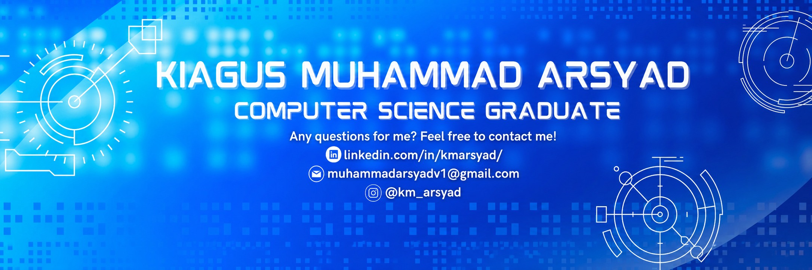

<!--
  GitHub Profile README for Kiagus Muhammad Arsyad (@arsyadCode)
  Sections are labeled with HTML comments for easy editing.
  Placeholders you should fill in are marked with the word TODO.
  Optional widgets that need a handle or secret are wrapped in comment
  blocks labeled OPT-IN; uncomment once configured.
  Theme: Tokyo Night (kept consistent across every card).
-->

<!-- ══════════════════════════ HERO / HEADER ══════════════════════════ -->

  <em>~ Assalamu'alaikum Warahmatullahi Wabarakatuh ~</em>

<h1 align="center">Kiagus Muhammad Arsyad</h1>

  <!-- Typing animation cycling the five roles -->
  

  <em>Turning data into decisions and ideas into intelligent systems — from Indonesia, for the world. 🌏</em>

<!-- ══════════════════════════ QUICK BADGES ══════════════════════════ -->

  
  
  <!-- TODO: replace with your portfolio URL when ready (defaults to LinkedIn) -->
  

  
  
  

<!-- ══════════════════════════ SECTION DIVIDER ══════════════════════════ -->

<!-- ══════════════════════════ ABOUT ME ══════════════════════════ -->
## 🧭 About Me

> I'm a Computer Science graduate from **Universitas Pertamina, Indonesia**, working at the
> intersection of **Artificial Intelligence, Data Science, and Full-Stack Engineering**.
> I build end-to-end intelligent systems — from research and modeling to shipping the product
> around them — and I'm driven by curiosity, teamwork, and a technopreneur's mindset:
> using technology to create real, lasting value for people.

<table>
  <tr>
    <td>🔬</td><td><b>Focus</b></td>
    <td>Applied AI/ML · LLMs & AI Agents · Data Science · AI Automation</td>
  </tr>
  <tr>
    <td>🌱</td><td><b>Currently</b></td>
    <td>Deepening MLOps, Generative AI, and agentic AI workflows</td>
  </tr>
  <tr>
    <td>🎓</td><td><b>Background</b></td>
    <td>CS @ Universitas Pertamina · <a href="https://github.com/arsyadCode/TuRu-ML_CC">Bangkit Academy</a> Machine Learning graduate</td>
  </tr>
  <tr>
    <td>🤝</td><td><b>Open to</b></td>
    <td>Research collaboration, open-source, and AI/Data engineering opportunities</td>
  </tr>
  <tr>
    <td>📍</td><td><b>Location</b></td>
    <td>Indonesia 🇮🇩 · Learning online since 2020 (Dicoding · Coursera · Udemy · DQLab · AI Planet)</td>
  </tr>
  <tr>
    <td>⚡</td><td><b>Fun fact</b></td>
    <td>I love encouraging teams toward one shared mission — succeeding together.</td>
  </tr>
</table>

<!-- ══════════════════════════ TECH DASHBOARD ══════════════════════════ -->
## 🛠️ AI &amp; Coding Dashboard

<table>
  <tr>
    <td valign="top"><b>💬 Languages</b></td>
    <td>
      
      
      
      
      
      
      
      
    </td>
  </tr>
  <tr>
    <td valign="top"><b>🤖 AI &amp; ML</b></td>
    <td>
      
      
      
      
      
      
      
      
    </td>
  </tr>
  <tr>
    <td valign="top"><b>📊 Data Science</b></td>
    <td>
      
      
      
      
      
      
    </td>
  </tr>
  <tr>
    <td valign="top"><b>📈 Visualization</b></td>
    <td>
      
      
      
      
      
      
    </td>
  </tr>
  <tr>
    <td valign="top"><b>⚙️ Backend</b></td>
    <td>
      
      
      
      
      
    </td>
  </tr>
  <tr>
    <td valign="top"><b>🎨 Frontend &amp; Mobile</b></td>
    <td>
      
      
      
      
      
      
    </td>
  </tr>
  <tr>
    <td valign="top"><b>☁️ Cloud &amp; DevOps</b></td>
    <td>
      
      
      
      
      
    </td>
  </tr>
  <tr>
    <td valign="top"><b>🗄️ Databases</b></td>
    <td>
      
      
      
      
      
    </td>
  </tr>
  <tr>
    <td valign="top"><b>🧰 Productivity</b></td>
    <td>
      
      
      
      
      
    </td>
  </tr>
</table>

<!-- ══════════════════════════ GITHUB ANALYTICS ══════════════════════════ -->
## 📊 GitHub Analytics

<!--
  These cards are SELF-HOSTED: generated by .github/workflows/profile-summary-cards.yml
  and committed into this repo (profile-summary-card-output/tokyonight/), then served
  from raw.githubusercontent. No external live service = they can never be rate-limited
  (this is what replaced the old 402-erroring public stats/trophy widgets).
  First-time setup: GitHub → Actions → "Generate Profile Summary Cards" → Run workflow.
  Until that first run completes, the four cards below will 404 (blank).
-->

  

  
  

<!-- Streak (live service — DenverCoder1, actively maintained) -->

  

<!-- Activity graph (live service — actively maintained) -->

  

<!-- Productivity metrics — self-hosted card (replaces the old trophy widget) -->

  

<!--
  OPT-IN: GitHub Trophies. The public github-profile-trophy.vercel.app instance
  currently returns 402 (Vercel quota). To use it, self-host: fork
  https://github.com/ryo-ma/github-profile-trophy , deploy to Vercel, then uncomment
  and point the URL at your instance.
  

    
  

-->

<!-- ══════════════════════════ CONTRIBUTION SNAKE ══════════════════════════ -->
## 🐍 Contribution Snake

<!--
  Rendered by the workflow in .github/workflows/snake.yml which publishes the SVG
  to the "output" branch. If blank: GitHub → Actions → "Generate Snake" → Run workflow.
-->

  <picture>
    <source media="(prefers-color-scheme: dark)" srcset="https://raw.githubusercontent.com/arsyadCode/arsyadCode/output/github-snake-dark.svg" />
    <source media="(prefers-color-scheme: light)" srcset="https://raw.githubusercontent.com/arsyadCode/arsyadCode/output/github-snake.svg" />
    
  </picture>

<!-- ══════════════════════════ FEATURED PROJECTS ══════════════════════════ -->
## 🚀 Featured Projects

<table>
  <thead>
    <tr>
      <th align="left">Project</th>
      <th align="left">Description</th>
      <th align="left">Tech</th>
      <th align="center">Status</th>
    </tr>
  </thead>
  <tbody>
    <tr>
      <td><a href="https://github.com/arsyadCode/TuRu-ML_CC"><b>TuRu — ML</b></a></td>
      <td>Sign-language translator (<em>Translator Tuna Rungu</em>) — Bangkit capstone ML model.</td>
      <td>
        
        
      </td>
      <td align="center"></td>
    </tr>
    <tr>
      <td><a href="https://github.com/arsyadCode/TuRu-MD"><b>TuRu — Android</b></a></td>
      <td>Android client for the TuRu sign-language translator capstone.</td>
      <td>
        
        
      </td>
      <td align="center"></td>
    </tr>
    <tr>
      <td><a href="https://github.com/arsyadCode/crop-yield-nowcasting"><b>Crop Yield Nowcasting</b></a></td>
      <td>Data-science pipeline for near-real-time crop yield estimation.</td>
      <td>
        
        
      </td>
      <td align="center"></td>
    </tr>
    <tr>
      <td><a href="https://github.com/arsyadCode/ProjekTA_UPERESEARCH"><b>Undergraduate Thesis</b></a></td>
      <td>Final research project (UPER) — ML-driven analysis &amp; modeling.</td>
      <td>
        
        
      </td>
      <td align="center"></td>
    </tr>
    <tr>
      <td><a href="https://github.com/arsyadCode/PrototypeEstungkaraHarsa"><b>Estungkara Harsa</b></a></td>
      <td>Agora Hackathon 2022 prototype — real-time interactive application.</td>
      <td>
        
        
      </td>
      <td align="center"></td>
    </tr>
    <tr>
      <td><a href="https://github.com/arsyadCode/PraktikumML-CS2023"><b>ML Practicum 2023</b></a></td>
      <td>Machine Learning practicum materials — UPER Computer Science.</td>
      <td>
        
        
      </td>
      <td align="center"></td>
    </tr>
  </tbody>
</table>

<a href="https://github.com/arsyadCode?tab=repositories">→ Browse all repositories</a>

<!-- ══════════════════════════ PROFESSIONAL TIMELINE ══════════════════════════ -->
## 🧗 Professional Timeline

<!--
  TODO: Fill in your real dates/details below. Example rows are placeholders —
  edit or delete each one. Keep the table format for a clean timeline look.
-->
<table>
  <tr>
    <td align="center"><b>Year</b></td>
    <td><b>Milestone</b></td>
    <td><b>Type</b></td>
  </tr>
  <tr>
    <td align="center">2020</td>
    <td>Began self-directed learning — Dicoding, Coursera, Udemy, DQLab, AI Planet</td>
    <td>🎓 Learning</td>
  </tr>
  <tr>
    <td align="center">2022</td>
    <td>Agora Hackathon 2022 — <em>Estungkara Harsa</em> prototype</td>
    <td>🏆 Competition</td>
  </tr>
  <tr>
    <td align="center">2023</td>
    <td>Bangkit Academy — Certified Independent Study of Machine Learning (TuRu capstone)</td>
    <td>📜 Certification</td>
  </tr>
  <tr>
    <td align="center"><!-- TODO: year --></td>
    <td><!-- TODO: e.g. B.CS, Universitas Pertamina — thesis title --></td>
    <td>🎓 Education</td>
  </tr>
  <tr>
    <td align="center"><!-- TODO: year --></td>
    <td><!-- TODO: your current role / position --></td>
    <td>💼 Experience</td>
  </tr>
</table>

<!-- ══════════════════════════ ACHIEVEMENT DASHBOARD ══════════════════════════ -->
## 🏅 Achievement Dashboard

<!-- TODO: Replace the example entries below with your real achievements, or remove rows you don't have. -->
<table>
  <tr>
    <td valign="top" width="50%">
      <h4>🏆 Competitions &amp; Awards</h4>
      <ul>
        <li>Agora Hackathon 2022 — Participant</li>
        <li><!-- TODO: award / rank / event --></li>
      </ul>
    </td>
    <td valign="top" width="50%">
      <h4>📜 Certifications</h4>
      <ul>
        <li>Bangkit Academy — Machine Learning Path</li>
        <li><!-- TODO: certification (issuer, year) --></li>
      </ul>
    </td>
  </tr>
  <tr>
    <td valign="top">
      <h4>🔬 Research &amp; Publications</h4>
      <ul>
        <li>Undergraduate thesis — <!-- TODO: title --></li>
        <li><!-- TODO: publication / DOI --></li>
      </ul>
    </td>
    <td valign="top">
      <h4>🎤 Leadership &amp; Speaking</h4>
      <ul>
        <li>ML Practicum — teaching materials for UPER CS</li>
        <li><!-- TODO: leadership role / talk --></li>
      </ul>
    </td>
  </tr>
</table>

<!-- ══════════════════════════ RESEARCH INTERESTS ══════════════════════════ -->
## 🔭 Research Interests

  
  
  
  
  
  
  
  
  
  
  
  

<!-- ══════════════════════════ NOW / CURRENT FOCUS ══════════════════════════ -->
## ⚡ Now — Current Focus

<table>
  <tr>
    <td>🔨 <b>Building</b></td>
    <td>End-to-end AI/data pipelines and AI-automation workflows</td>
  </tr>
  <tr>
    <td>📚 <b>Learning</b></td>
    <td>Generative AI, LLM orchestration &amp; AI agents, MLOps, cloud-native deployment</td>
  </tr>
  <tr>
    <td>🧪 <b>Researching</b></td>
    <td>Applied ML for real-world impact (agriculture, accessibility, digital transformation)</td>
  </tr>
  <tr>
    <td>🎯 <b>Long-term goal</b></td>
    <td>Grow as an AI Engineer &amp; Data Scientist who ships research into products people rely on</td>
  </tr>
</table>

<!-- ══════════════════════════ OPEN SOURCE ══════════════════════════ -->
## 🌍 Open Source &amp; Collaboration

- 💡 **Interests:** applied ML, data tooling, AI-agent skills, accessibility tech
- 🔥 **Current focus:** experimenting with agentic AI skills & automation
- 🤝 **Looking to collaborate on:** AI/Data-Science research and open-source ML projects
- 💬 **Ask me about:** Machine Learning, Data Science, Python, and turning ideas into MVPs
- 📫 **Reach me:** [LinkedIn](https://www.linkedin.com/in/kmarsyad/) · [Email](mailto:muhammadarsyadv2@gmail.com)

<!-- ══════════════════════════ OPTIONAL PREMIUM WIDGETS (OPT-IN) ══════════════════════════ -->

  
✨ <b>Optional widgets</b> (enable once you add the required handle/secret)

 

<!-- OPT-IN: WakaTime — sign up at wakatime.com, connect your editor, set profile to public,
     then uncomment. Replace USERNAME with your WakaTime username.

  

-->

<!-- OPT-IN: Kaggle — replace KAGGLE_USER (the badge links to your Kaggle profile).

  

-->

<!-- OPT-IN: LeetCode stats (service: github.com/JacobLinCool/LeetCode-Stats-Card).

  

-->

<!-- OPT-IN: Google Scholar / ORCID — replace the IDs.

  
  

-->

<!-- OPT-IN: Spotify now-playing (service: github.com/kittinan/spotify-github-profile — needs one-time OAuth setup).

  

-->

<!-- OPT-IN: Quote of the day.

  

-->

_These are commented out so nothing renders broken. Uncomment a block after adding its handle/secret._

<!-- ══════════════════════════ CONTACT FOOTER ══════════════════════════ -->
## 📫 Let's Connect

  
  
  

  <em>“Succeeding together — one shared mission at a time.”</em>

  ⭐ Thanks for visiting — <em>Wassalamu'alaikum Warahmatullahi Wabarakatuh</em> 🙏🏻

